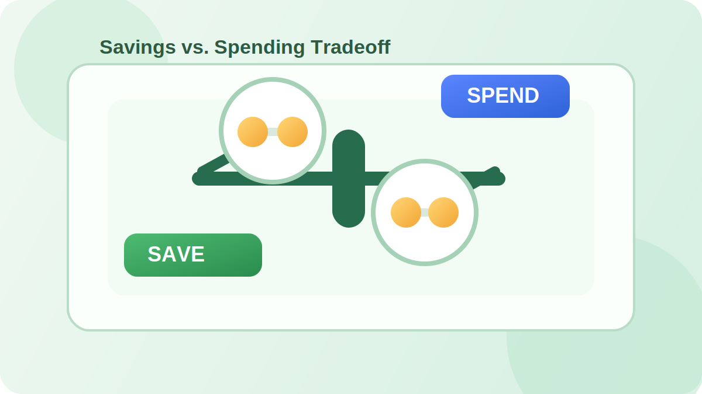
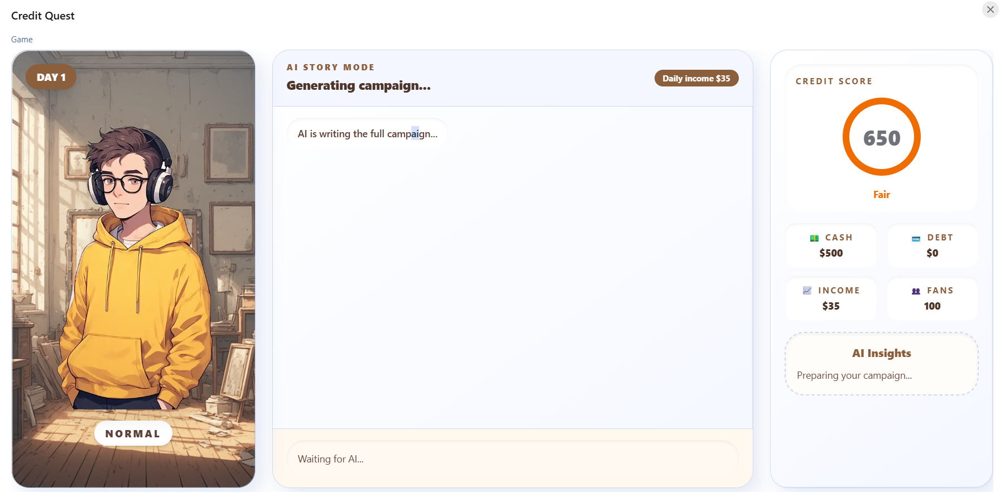
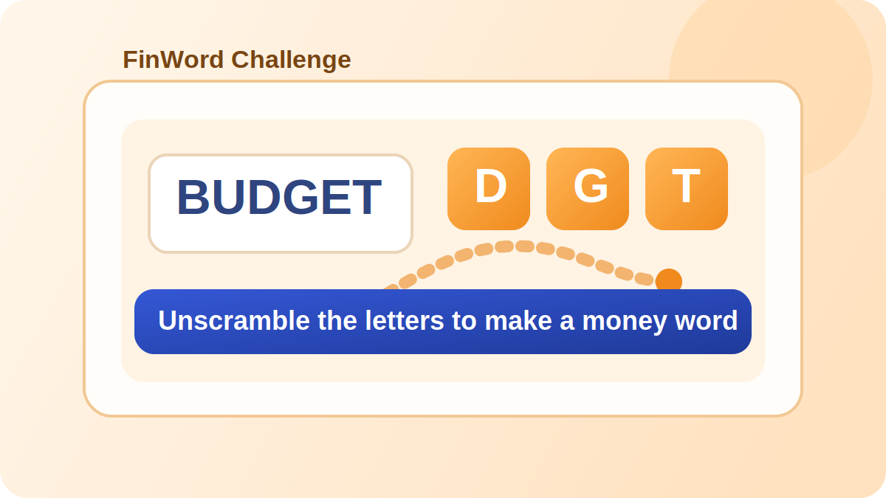
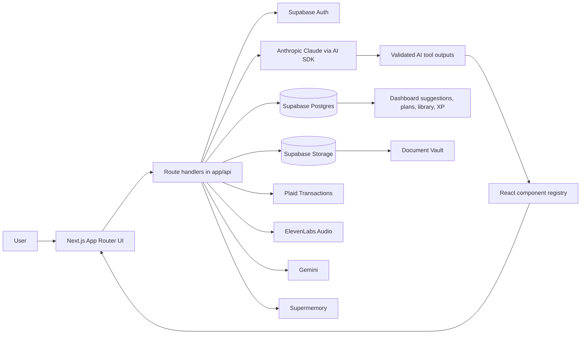

# MoneyNest

Personalized financial wellness app for learning, planning, budgeting, document review, and interactive money simulations.

<p align="center">
  
</p>

MoneyNest is a Next.js application that helps users turn messy financial context into practical guidance. Users can onboard through voice, forms, document upload, or Plaid; then Cents, the in-app financial assistant, uses their profile, budget activity, documents, learning history, and saved plans to generate contextual coaching and interactive components.

The strongest engineering idea is the "AI output as product UI" layer: the assistant does not only return text. It streams validated tool outputs through the Vercel AI SDK and maps model-emitted descriptors to reusable React components, such as simulations, budget snapshots, learning cards, document explainers, mini-games, and action plans.

## Preview

Demo videos:

- [MoneyNest demo video 1](https://www.youtube.com/watch?v=t1MBPpjHlUk)
- [MoneyNest demo video 2](https://www.youtube.com/watch?v=xmmNFegN9XU)
- [MoneyNest demo video 3](https://www.youtube.com/watch?v=SFcgz3gaT4c)
- [Devpost submission](https://devpost.com/software/vela-0wnvbu)

In-repo visual assets:

<p>
  
  
  
</p>

## Highlights

- Multiple onboarding paths: voice setup, manual form entry, document extraction, and Plaid bank connection.
- Multi-model routing: Claude Sonnet handles chat and document extraction, Claude Haiku handles lightweight suggestions/profile extraction, and Gemini 2.5 Flash Image generates concept visuals.
- Context-aware AI coaching built from Supabase profile data, recent budget entries, uploaded documents, active plans, learning progress, and Supermemory recall.
- Tool-driven generative UI: `streamText()` can run up to five tool steps, then render outputs through a live component registry instead of plain chat text.
- Document vault with Supabase Storage upload, Anthropic document extraction, plain-language summaries, risk flags, and what-if prompts.
- Budget system with manual entries, CSV import for YNAB/Mint/generic exports, Plaid transaction sync, charts, >20% category spend-spike suggestions, and profile sync prompts.
- Learning loop with saved artifacts, mini-games, XP tracking, leaderboard views, and English/Spanish localization.

## Use Cases

| Use Case | User | Outcome |
| --- | --- | --- |
| Build a financial profile quickly | New user | Onboard through conversation, forms, documents, or bank connection |
| Understand a bill, lease, pay stub, or insurance document | Consumer reviewing paperwork | Get summaries, risk flags, clauses, and follow-up prompts |
| Analyze spending | Budget-conscious user | Import transactions, see charts, detect spikes, and ask Cents for next steps |
| Learn financial concepts through play | Student or first-time learner | Practice with simulations, term matching, credit scenarios, and XP feedback |
| Revisit generated guidance | Returning user | Save plans, games, learning cards, and document explainers to the library |

## Features

**Personalized Coaching**

- Cents chat assistant with persisted sessions and message history.
- Dynamic system prompt built from the user's current financial state.
- Proactive dashboard suggestions generated from profile, budget, plans, and learning state.
- Learning confidence advances from exposure counters into low/medium/high states, and mastered concepts are suppressed from future explanations.
- Action plans with profile snapshot hashes so stale plans can be flagged when financial data changes.

**Budgeting And Accounts**

- Manual income and expense entries.
- CSV import with YNAB, Mint, and generic bank export support.
- Plaid link token creation and transaction import.
- Recharts visualizations for income, expenses, and top categories.

**Documents**

- Upload financial documents to private Supabase Storage.
- Extract document type, clauses, numbers, summaries, risk flags, and what-if scenarios.
- Search and filter documents by filename, type, and extracted content.
- Store document memory for later assistant recall.

**Interactive Learning**

- Component registry for AI-rendered UI: `budget_snapshot`, `document_explainer`, `crisis_simulator`, `learning_card`, `mini_game`, `action_plan`, and more.
- Mini-game catalog with Savings vs. Spending, Insurance Card Game, Credit Quest, Financial Term Match, FinWord, Wealth Farm, and RiskRaid.
- Credit Quest and RiskRaid fetch the live profile to personalize LLM-generated practice scenarios around income, debts, savings, goals, and risk context.
- XP tracking and leaderboard routes for game activity.
- Text-to-speech, sound effects, music, dubbing, and voice agent endpoints through ElevenLabs.

## Tech Stack

| Layer | Technology | Purpose |
| --- | --- | --- |
| App framework | Next.js 15 App Router, React 19 | Full-stack routing, server components, route handlers, client UI |
| Language | TypeScript | Typed domain models, route payloads, and component contracts |
| UI | Tailwind CSS 4, HeroUI, lucide-react, Framer Motion | Responsive interface, controls, icons, and motion |
| Auth/data/storage | Supabase Auth, Postgres, Storage, RLS | User accounts, relational app data, private documents, row-level access control |
| AI orchestration | Vercel AI SDK, Anthropic Claude Sonnet/Haiku | Streaming chat, tool calls, document extraction, suggestions, profile extraction |
| Media AI | Gemini 2.5 Flash Image, ElevenLabs | Concept image generation, multilingual voice/audio features |
| Financial data | Plaid | Read-only bank linking and transaction sync |
| Memory | Supermemory | Cross-session document/context recall |
| Forms/data viz/parsing | React Hook Form, Zod, Recharts, PapaParse | Onboarding forms, validation, charts, and CSV import |
| Localization | Custom i18n helpers | English and Spanish UI copy with locale cookie middleware |
| Quality | ESLint, Prettier, TypeScript strict mode | Static checks and formatting rules |

## Architecture



## How It Works

1. A user authenticates with Supabase through email/password or Google OAuth.
2. Root routing checks whether the user has a linked app user row and completed profile, then redirects to onboarding or dashboard.
3. Onboarding captures financial context through voice, form fields, document extraction, or Plaid transaction sync.
4. The chat route fetches profile, learning progress, recent budget entries, active plans, uploaded documents, and relevant memories in parallel.
5. Anthropic streams a response with tool calls; each tool result is rendered by `components/generative/component-registry.tsx` and persisted to Supabase.
6. Users can save generated plans, simulations, learning cards, games, and document explainers into the library for replay.

## Setup

Prerequisites:

- Node.js 20+
- npm
- Supabase project
- Provider credentials for features you want to run: Anthropic, Plaid, ElevenLabs, Gemini, and Supermemory

Install dependencies:

```bash
npm install
```

Create local environment variables:

```bash
cp .env.example .env
```

Required variables are listed in [.env.example](.env.example):

```bash
NEXT_PUBLIC_APP_URL=http://localhost:3000
NEXT_PUBLIC_SUPABASE_URL=
NEXT_PUBLIC_SUPABASE_ANON_KEY=
SUPABASE_SERVICE_ROLE_KEY=
ANTHROPIC_API_KEY=
GEMINI_API_KEY=
ELEVENLABS_API_KEY=
NEXT_PUBLIC_ELEVENLABS_AGENT_ID=
SUPERMEMORY_API_KEY=
PLAID_CLIENT_ID=
PLAID_SECRET=
PLAID_ENV=sandbox
```

Set up the database:

1. Create a Supabase project.
2. Apply [supabase/schema.sql](supabase/schema.sql).
3. Configure Supabase Auth providers for the login methods you want to support.
4. Confirm the private `vela-files` storage bucket and storage policy from the schema are applied.

Run locally:

```bash
npm run dev
```

Build for production:

```bash
npm run build
```

Run the production server locally:

```bash
npm run start
```

Lint and autofix:

```bash
npm run lint
```

There is no test script in `package.json` yet.

## Usage

Typical app flow:

1. Sign in or create an account at `/login`.
2. Complete onboarding with one of the available paths: voice, form, document upload, or Plaid.
3. Review your dashboard health score and Cents suggestions.
4. Add or import budget entries, then use "Analyze with Cents" to send a budget summary into chat.
5. Upload documents in the Document Vault to generate summaries, clauses, risk flags, and follow-up scenarios.
6. Ask Cents for help in chat, save useful generated components, and replay them from the Library.
7. Play mini-games from the Library or standalone `/games/*` routes and track XP on the leaderboard.

Important routes:

| Route | Purpose |
| --- | --- |
| `/dashboard` | Health score and proactive suggestions |
| `/onboarding` | Profile setup through voice, form, document, or Plaid |
| `/chat` | Cents assistant with generative UI |
| `/budget` | Manual entries, CSV import, charts, and budget analysis |
| `/documents` | Document upload, search, filtering, and review |
| `/library` | Prebuilt games plus saved generated artifacts |
| `/plans` | Saved action plans and stale-plan indicators |
| `/leaderboard` | XP rankings from game activity |

## Key Decisions

| Decision | Rationale | Tradeoff |
| --- | --- | --- |
| Use AI tools as UI contracts | Keeps model output renderable, saveable, and replayable as product components | Requires careful schema design and registry maintenance |
| Build agent context server-side | Lets Cents answer from current profile, documents, plans, budget, and learning state | Chat route depends on several data sources and provider availability |
| Store generated artifacts separately from messages | Supports a library of reusable plans, games, simulations, and explainers | Adds another persistence model to keep in sync |
| Replay JSONB component snapshots | Avoids regenerating saved simulations, document explainers, learning cards, and mini-games across sessions | Saved components need backward-compatible props as UI evolves |
| Hash profile snapshots for plans | Detects when a saved plan may be based on outdated financial data | Only flags staleness; it does not automatically migrate plan content |
| Use Supabase RLS across user-owned tables | Enforces per-user access at the database layer | Policies and app queries must stay aligned |
| Support several onboarding paths | Reduces friction for users with different comfort levels and data availability | More integration paths to test and maintain |

## Notable Work

- The assistant strips historical tool parts before sending messages back to Anthropic, avoiding invalid tool history while preserving a note about previously rendered components.
- Document extraction writes both structured document records and memory entries, allowing later chat responses to reference uploaded documents.
- Budget import detects category spikes above a 20% prior-period baseline after CSV ingestion and creates dismissible suggestions without blocking the import response.
- Crisis simulations make tradeoffs concrete with day-specific decisions, dollar impacts, balance changes, and follow-up chat events.
- Localization is wired through middleware, cookie-based locale detection, and shared message catalogs for English and Spanish.
- The database schema separates identity, profiles, messages, saved artifacts, documents, plans, budget entries, learning progress, suggestions, Plaid connections, and game XP.

## Potential Metrics To Track

| Metric | Why It Matters |
| --- | --- |
| Onboarding completion by path | Shows whether voice, form, document, or Plaid is the lowest-friction setup flow |
| Suggestion click-through and dismissal rate | Measures whether proactive recommendations are relevant |
| Document extraction success rate | Tracks reliability of document upload and AI parsing |
| Saved artifact replay rate | Indicates whether generated plans, games, and explainers remain useful after chat |
| Game completion and XP activity | Measures engagement with learning-by-doing features |

## Roadmap Ideas

- Add focused tests for CSV parsing, profile health scoring, profile snapshot hashes, and route validation.
- Add screenshots or a short GIF walkthrough to make the README visually representative without leaving GitHub.
- Add graceful feature flags for missing provider credentials so local development can run with partial integrations.
- Add Supabase migration files or CLI instructions so schema setup is repeatable.
- Add analytics for onboarding paths, saved artifact usage, document extraction outcomes, and game engagement.

## License

See [LICENSE](LICENSE). The current file is an MIT license inherited from the upstream template and should be reviewed before external distribution under the MoneyNest project name.
